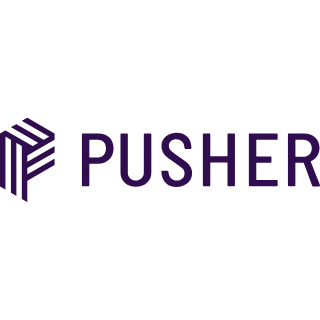

<!-- 

 -->

## CRM System for FRESH EXPRESS

## About the project

This  project is a  CRM system for a grocery store (FRESH EXPRESS) that provides fresh items such as Meat, Vegetable, Fruits, and seafood. 

The CRM system manages inventory, measure sales, keep track of the client information, order management, supplier management, send promotion details to customer.

### This system is built using 

 

Laravel , Livewire , Tailwind CSS , Alphine JS

Authentication is done by using laravle Jetstream.

## Customer User Interface 

For the customer user interface a mobile application has beed developed using Flutter & Dart.

 

### Other technologies used 

#### Mailtrap 
- On completion of dispatch of each order system will send an email to the customer saying the order has been dispatched with the orderinformation this is been done by mailtrap.

 

#### Pusher 
- To inform the CRM users an order has been arrived to the system this is been done using pusher.

 

This project is being developed as a requirement of a second year module called Server Side Programming.

If you want to download the project locally , follow the [installation]() below.

## Features

