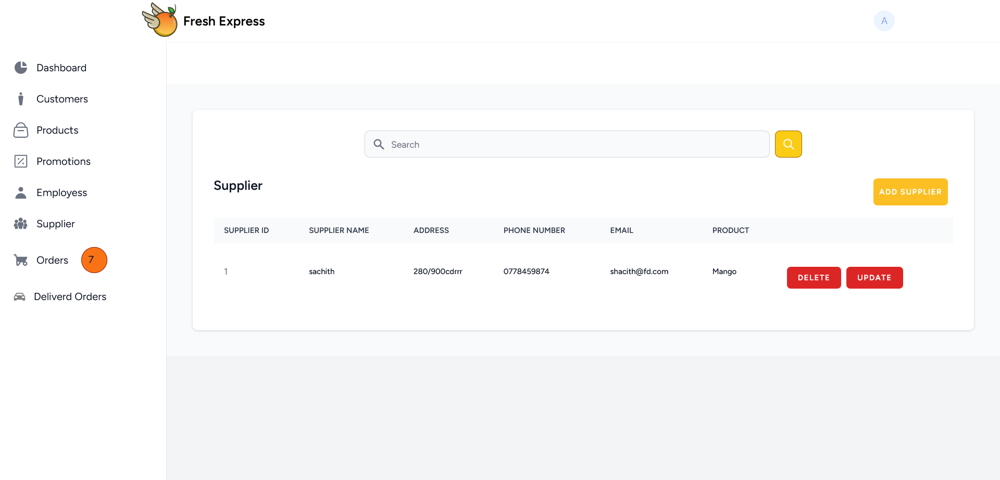

## CRM System for FRESH EXPRESS

<p align="center"></p>

## About the project

This  project is a  CRM system for a grocery store (FRESH EXPRESS) that provides fresh items such as Meat, Vegetable, Fruits, and seafood. 

The CRM system manages inventory, measure sales, keep track of the client information, order management, supplier management, send promotion details to customer.

### CRM  system is built using 

<div>
<p><a href="https://laravel.com" target="_blank"></a>
<a href="https://laravel-livewire.com/" target="_blank"></a>
<a href="https://tailwindcss.com/" target="_blank"></a>
<a href="https://alpinejs.dev/" target="_blank"></a>
</p> 
</div>
Laravel , Livewire , Tailwind CSS , Alphine JS

Authentication is done using laravle Jetstream.

### Project Documemt
[View the report here](https://github.com/Thenuri/fresh-express/blob/a2f9dfd9406559d83f2fadc68f1eda771b7f9a48/ssp-2-document%20(1).pdf)


### Customer Interactions

For the customer interactions a mobile application has been developed using Flutter & Dart.
<div>
<p align="center"><a href="" target="_blank"></a>
<a href="" target="_blank"></a>
</p> 
GitHub repo Link:<a href="https://github.com/Thenuri/mad_fresh_express.git" target="_blank">Mobile Application(FRESH EXPRESS)</a>

</div>

### Other technologies used 

#### Mailtrap 
- On completion of dispatch of each order system will send an email to the customer saying the order has been dispatched with the orderinformation this is been done by mailtrap.
<p align="center"><a href="https://mailtrap.io/" target="_blank"></a>
</p> 

#### Pusher 
- To inform the CRM users an order has been arrived to the system this is been done using pusher.
<p align="center"><a href="https://pusher.com/" target="_blank"></a>
</p> 


This project is being developed as a requirement of a second year module called Server Side Programming.


If you want to download the project locally , follow the [installation](#installation) below.
</div>

## Features

#### Admin Features 
- Manage Accounts 
- Admin Login
- Can see customer details
- Can see the drivers and other employees in the system
- Add Promotions
- Add Products
- Dispatch an order
- View Dliverd Orders

#### Employee Features
- Login
- Register
- Can see customer details
- Can see the drivers in the system
- Add Promotions
- Add Products
- Dispatch an order

#### Customer Features
- Add item to cart
- Redeem loyalty points
- Choose favorite item
- Customer can see promotions
- Login
- Register
- Update Profile
- View Products
- Select Favorite 
- Send Feedback or Complain

## Screenshots

Below are the screenshots of the CRM system and the Mobile Application

### CRM System

<figure>
<figcaption align="center">Login Page</figcaption>

</figure>

<figure>
<figcaption align="center">Register Page</figcaption>

</figure>

<figure>
<figcaption align="center">Admin & employe dashboard Page</figcaption>


</figure>

<figure>
<figcaption align="center">Customer Page</figcaption>

</figure>

<figure>
<figcaption align="center">Products Page</figcaption>

</figure>

<figure>
<figcaption align="center">Promotions Page</figcaption>

</figure>

<figure>
<figcaption align="center">Employee Page</figcaption>

</figure>

<figure>
<figcaption align="center">Supplier Page</figcaption>

</figure>

<figure>
<figcaption align="center">Order Page</figcaption>

</figure>

<figure>
<figcaption align="center">Deliverd Order Page</figcaption>

</figure>

<figure>
<figcaption align="center">Driver Dashboard Page</figcaption>

</figure>

### Mobile application
<figure>
<figcaption align="center">Mobile</figcaption>


</figure>

## Installation

pre-requisites  that are needed to run the project

-   [Composer](https://getcomposer.org/download/)
-   [Node.js](https://nodejs.org/en/download/)
-   [NPM](https://www.npmjs.com/get-npm)
-   [PHP](https://www.php.net/downloads.php)
-   [Sqlite](or you can use [MySQL] https://dev.mysql.com/downloads/installer/)

[ XAMPP ](https://www.apachefriends.org/download.html) or [WAMP server](https://www.wampserver.com/en/download-wampserver-64bits/) can be used for PHP and MySQL.


1.  Clone the repo

    ```sh
    git clone https://github.com/Thenuri/fresh-express.git
    ```
2.  Move in to the CRM folder

    ```sh
    cd crm
    ```  
3.  Composer Install

    ```sh
    composer install
    ``` 
4.  NPM Install

    ```sh
    npm install
    ```
5. Create a new .env file and copy the .env.example file and past it to the .env file

6. Create a database and add the database credentials to the .env file

If you are using sqlite use laravel docs and follow the instructions https://laravel.com/docs/10.x/database#sqlite-configuration

8.  Run the migrations

    ```sh
    php artisan migrate
    ```
9.  Run the seeders

    ```sh
    php artisan db:seed
    ```
10. Run the project

    ```sh
    npm run dev
    ```

    open a new terminal and run without closing the above code 

    ```sh
    php artisan serve
    ```
11. Click on the site address to check the site in your terminal after typing this (php artisan serve) command 
http://127.0.0.1:8000

The admin user and some of the employees are being created using the database seeder,
The credentials are as follows
Admin<br>
email : 'admin@freshgmail.com'<br>
password : 'password'

Employee<br>
email : 'employee@gr.com'<br>
password :'customerpassword'